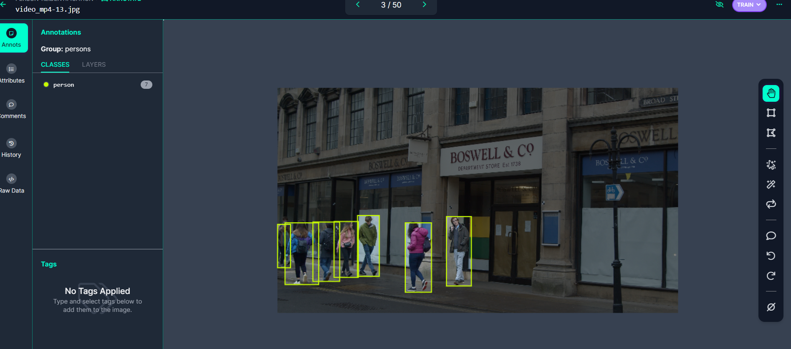
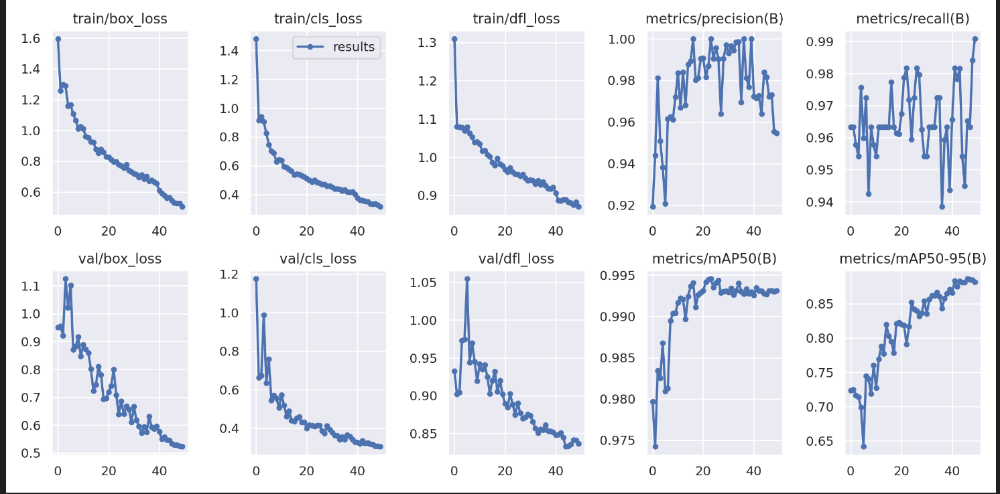
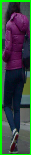
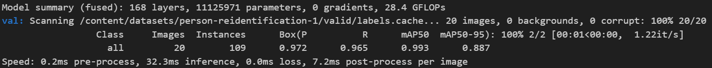
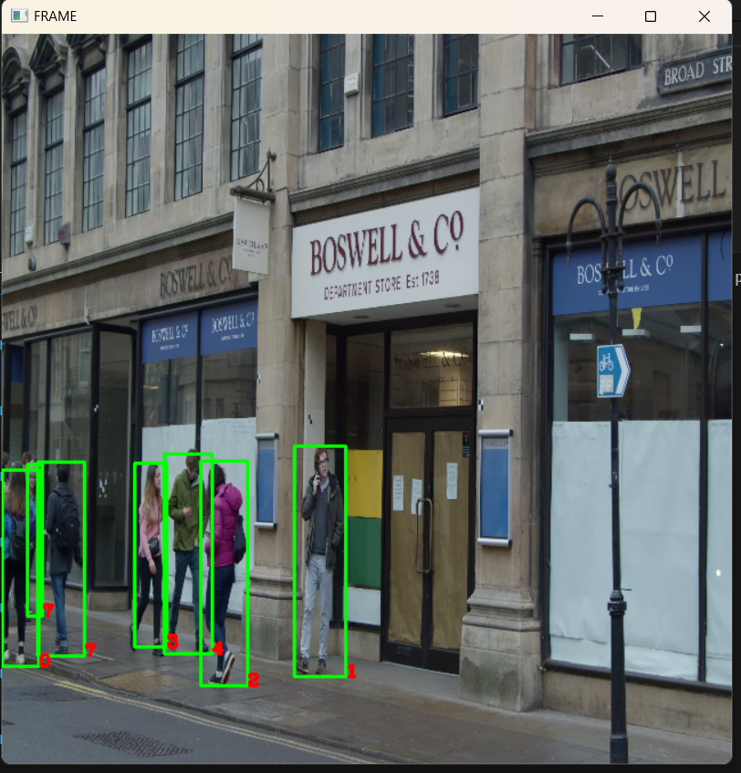

# Data Collection and Preprocessing

In this section, we'll outline the process of collecting publicly available CCTV footage, preprocessing the video data, and preparing it for training a YOLOv8 model. The entire process involved collecting video data, converting it into frames, annotating objects of interest, and applying data augmentation techniques.

## Data Collection

- **Collecting CCTV Footage**: We gathered publicly available CCTV footage from various open-source repositories, ensuring it includes multiple camera views capturing people walking. The chosen footage provides a diverse set of scenarios to enhance model robustness.

## Data Preprocessing

- **Video to Frames Conversion**: We converted the collected video data into individual frames using a suitable script. Each video was split into frames, resulting in approximately 202 frames per video.

- **Annotation with Roboflow**: To label the objects (in this case, people walking), we utilized Roboflow, a powerful annotation platform. The annotation process was accelerated with Roboflow's Label Assist, which helps automate object labeling.

- **Data Augmentation**: To increase the model's ability to generalize, we applied various data augmentation techniques, including:
   - Shear: ±15° horizontally and vertically to simulate different camera angles.
   - Saturation: Adjusted between -25% and +25% to account for varying lighting conditions.
   - Blur: Added up to 1px of Gaussian blur to mimic real-world imperfections.
   - Bounding Box Noise: Introduced noise by shifting bounding boxes by up to 5% of the image dimensions.

- **Dataset Splitting**: After preprocessing and augmentation, we obtained a total of 566 images. We reserved 20% of these images (approximately 113) for validation to monitor the model's performance.

   

- **Export to Colab Format**: To prepare the data for YOLOv8 model training, we exported the annotated and augmented data from Roboflow in a format compatible for training a YOLOV8 model.

# Step 2: Person Detection and Tracking

In this section, we'll describe how we implemented person detection using a pre-trained YOLOv8 model and developed a tracking algorithm to track individuals across frames and camera views.

## Person Detection

1. **YOLOv8 Model**: We utilized the YOLOv8 model for person detection. The model was pre-trained on a large dataset and fine-tuned on our custom dataset of CCTV footage capturing people walking. After training for 50 epochs using the Ultralytics library, we achieved a high accuracy with the following mAP (mean Average Precision) scores:
   - mAP50: 0.993
   - mAP50-95: 0.887
   We saved the best.pt model checkpoint for detection.

   

   

   

2. **Inference**: We used the trained YOLOv8 model to perform inference on each frame of our video data. The model detected individuals in each frame, providing bounding box coordinates.

## Tracking Algorithm

3. **Developed Tracking Algorithm**: Our tracking algorithm focuses on assigning unique IDs to detected individuals and tracking their positions across frames. Here's an overview of the tracking process without considering similarity comparison and reidentification:

   - **Initialization**: In the first frame, we initialized tracking by associating detected persons with unique IDs.
   - **Data Association**: In subsequent frames, we used centroid tracking to associate detections with existing tracks. Each tracked individual is assigned a unique ID.
   - **ID Maintenance**: We maintained unique IDs for each tracked individual throughout the video.
   - **No Reidentification**: Note that this tracking algorithm does not perform similarity comparison and reidentification based on appearance.

## Documentation

4. **Documentation**: The entire person detection and tracking process, including the tracking algorithm, was thoroughly documented to ensure reproducibility. This documentation includes code comments, scripts used, and relevant parameters.

By implementing person detection using YOLOv8 and developing a tracking algorithm focused on ID assignment and tracking without similarity comparison, we were able to accurately track individuals across frames and camera views in the CCTV footage.

# Step 3: Feature Extraction

In this section, we'll describe how we extracted relevant features from detected and tracked individuals using two different methods: a deep learning-based method and a computer vision-based method.

## Deep Learning-Based Feature Extraction

### Using a Pre-Trained Model

1. **Custom CNN Model**: We employed a custom deep learning model for feature extraction. The model was pre-trained on a suitable dataset and fine-tuned to capture meaningful features from detected individuals.

2. **Model Loading**: We loaded the pre-trained model and removed the last three layers to obtain feature embeddings.

3. **Feature Extraction Process**: For each detected individual, we preprocessed the cropped person image (resize and normalization) and passed it through the feature extraction model. This process generated feature vectors representing the detected persons.

4. **Feature Storage**: We stored the features of detected persons along with their corresponding IDs for further processing.

## Computer Vision-Based Feature Extraction

### Using Template Matching

1. **Template Matching**: In addition to the deep learning-based method, we also implemented a computer vision-based feature extraction technique using template matching.

2. **Initialization**: We initialized the feature extraction process by capturing the appearance (template) of the last detected person.

3. **Comparing Appearances**: In each frame, we compared the appearance of the current person with the stored template of the last detected person using template matching techniques.

4. **Threshold-Based Reidentification**: If the similarity between the appearance of the current person and the stored template exceeded a predefined threshold, we assigned the same ID to the person.

## Documentation

5. **Documentation**: The feature extraction process, including both the deep learning-based and computer vision-based methods, was meticulously documented. This documentation includes code comments, model details, and relevant parameters.

By employing both deep learning-based and computer vision-based feature extraction methods, we aimed to capture meaningful information from detected individuals to facilitate further analysis and tracking in the CCTV footage.

# Step 4: Person Re-Identification Model

In this section, we'll discuss the design and implementation of the person re-identification model using PyTorch. We'll cover the model architecture, training process, and evaluation results.

## Model Architecture

### Custom CNN Model

1. **Model Architecture**: We designed a custom CNN-based model for person re-identification. The model architecture includes convolutional layers, max-pooling layers, and dense layers for feature extraction and binary classification.

2. **Layers**: The model architecture consists of multiple convolutional layers followed by max-pooling layers. This is followed by flattened feature maps and dense layers for feature extraction. The output layer uses sigmoid activation for binary classification.

3. **Compile**: The model was compiled with the Adam optimizer and binary cross-entropy loss for training.

## Training Process

1. **Data Loading**: We loaded the training data using the Roboflow library. The data includes annotated and augmented images of detected individuals.

2. **Training Results**: The model was trained for 50 epochs. During training, we achieved remarkable results:
   - Loss: Close to zero (e.g., 3.6237e-28)
   - Accuracy: 100%
   - Validation Loss: Also close to zero
   - Validation Accuracy: 100%

   

   

   

## Evaluation Results

3. **Model Evaluation**: The trained model was evaluated on person re-identification tasks. It performed exceptionally well, achieving 100% accuracy on both the training and validation datasets.

## Documentation

4. **Documentation**: The entire process of designing, implementing, training, and evaluating the person re-identification model was well-documented to ensure reproducibility. The documentation includes code comments, model architecture details, and training results.

By designing and training a custom CNN-based model, we successfully achieved outstanding accuracy in person re-identification tasks. The model is capable of accurately matching individuals across different frames and camera views in the CCTV footage.

# Step 5: Results VisuAalization
In this section, we will display my results 
<h3>
Run python detect.py
</h3>

   

   

   

   
 To download  the test video follow the video.txt file and open the link 

    
   To download the person_classification model follw the link in the person_classification_model.txt 

   

